<h2>Northwind for SwiftData
  
</h2>

Note: SwiftData requires Xcode 15b+ and iOS 17/macOS 14.

[SwiftData](https://developer.apple.com/xcode/swiftdata/) 
version of Microsoft's Northwind Database,
filled from 
[NorthwindSQLite.swift](https://github.com/Northwind-swift/NorthwindSQLite.swift),
which is a packaged version of 
[Northwind-SQLite3](https://github.com/jpwhite3/northwind-SQLite3)
by @jpwhite3.

From Northwind-SQLite3:
> The Northwind sample database was provided with Microsoft Access as a tutorial
> schema for managing 
> small business customers, orders, inventory, purchasing, suppliers, shipping,
> and employees. 
> Northwind is an excellent tutorial schema for a small-business ERP, with
> customers, orders, inventory, 
> purchasing, suppliers, shipping, employees, and single-entry accounting.

It can be useful in the SwiftData context to play with SwiftData, as it provides
a pre-filled database and a set of models.
The database is a little old, but still useful to get started w/ an actual 
dataset.

### Using it in a SwiftUI app

1. Create a SwiftUI app in Xcode
2. Add NorthwindSwiftData as a dependency, the url is:
   `https://github.com/Northwind-swift/NorthwindSwiftData.git`
3. Setup the model container for the UI:

```swift
@main
struct NorthwindApp: App {

  var body: some Scene {
    WindowGroup {
      ContentView()
    }
    .modelContainer(try! NorthwindStore.modelContainer())
  }
}
```

That's it. It will copy the included database to the application support
directory of the application and setup everything else.

The other option is to use `.readOnlyModelContainer()` which will return a
container that directly accesses the embedded database.
Can be useful for tests and the like.


### Structure

The model structure as provided by [Northwind-SQLite3](https://github.com/jpwhite3/northwind-SQLite3).

```mermaid
erDiagram
    CustomerCustomerDemo }o--|| CustomerDemographics : have
    CustomerCustomerDemo }o--|| Customers : through
    Employees ||--|| Employees : "reports to"
    Employees ||--o{ EmployeeTerritories : through
    Orders }o--|| Shippers : "ships via"
    "Order Details" }o--|| Orders : have
    "Order Details" }o--|| Products : contain
    Products }o--|| Categories : in
    Products }o--|| Suppliers : "supplied by"
    Territories ||--|| Regions : in
    EmployeeTerritories }o--|| Territories : have
    Orders }o--|| Customers : place
    Orders }o--|| Employees : "sold by"


    Categories {
        int CategoryID PK
        string CategoryName
        string Description
        blob Picture
    }
    CustomerCustomerDemo {
        string CustomerID PK, FK
        string CustomerTypeID PK, FK
    }
    CustomerDemographics {
        string CustomerTypeID PK
        string CustomerDesc
    }
    Customers {
        string CustomerID PK
        string CompanyName
        string ContactName
        string ContactTitle
        string Address
        string City
        string Region
        string PostalCode
        string Country
        string Phone
        string Fax
    }
    Employees {
        int EmployeeID PK
        string LastName
        string FirstName
        string Title
        string TitleOfCourtesy
        date BirthDate
        date HireDate
        string Address
        string City
        string Region
        string PostalCode
        string Country
        string HomePhone
        string Extension
        blob Photo
        string Notes
        int ReportsTo FK
        string PhotoPath
    }
    EmployeeTerritories {
        int EmployeeID PK, FK
        int TerritoryID PK, FK
    }
    "Order Details" {
        int OrderID PK, FK
        int ProductID PK, FK
        float UnitPrice
        int Quantity
        real Discount
    }
    Orders {
        int OrderID PK
        string CustomerID FK
        int EmployeeID FK
        datetime OrderDate
        datetime RequiredDate
        datetime ShippedDate
        int ShipVia FK
        numeric Freight
        string ShipName
        string ShipAddress
        string ShipCity
        string ShipRegion
        string ShipPostalCode
        string ShipCountry
    }
    Products {
        int ProductID PK
        string ProductName
        int SupplierID FK
        int CategoryID FK
        int QuantityPerUnit
        float UnitPrice
        int UnitsInStock
        int UnitsOnOrder
        int ReorderLevel
        string Discontinued
    }
    Regions {
        int RegionID PK
        string RegionDescription
    }
    Shippers {
        int ShipperID PK
        string CompanyName
        string Phone
    }
    Suppliers {
        int SupplierID PK
        string CompanyName
        string ContactName
        string ContactTitle
        string Address
        string City
        string Region
        string PostalCode
        string Country
        string Phone
        string Fax
        string HomePage
    }
    Territories {
        string TerritoryID PK
        string TerritoryDescription
        int RegionID FK
    }

```




### Creating the Database

The package includes a filled Northwind database created from the data provided in
[Northwind-SQLite3](https://github.com/jpwhite3/northwind-SQLite3).
It is imported using
[NorthwindSQLite.swift](https://github.com/Lighter-swift/NorthwindSQLite.swift)
by a separate
[Importer Tool](https://github.com/Northwind-swift/SwiftDataImporter.git).

Note: The import takes hours to run ⏳


### Bugs

The SQLite version of Northwind has a few bugs, mostly related to optionality
(i.e. a lot of columns are marked as NULLable which likely shouldn't be).
The goal is to fix those in the SwiftData model & import, PRs are welcome.
Though it shouldn't be overly non-null, even if fields are never set to
NULL in the DB (e.g. address fields).


### Links

- Swift Package URL: `https://github.com/Northwind-swift/NorthwindSwiftData.git`
- Filing [GitHub Issues](https://github.com/Northwind-swift/NorthwindSwiftData/issues)
- Other Northwind Variants:
  - [jpwhite3/northwind-SQLite3](https://github.com/jpwhite3/northwind-SQLite3),
    just SQLite, the upstream DB used here.
  - [NorthwindSQLite.swift](https://github.com/Northwind-swift/NorthwindSQLite.swift.git),
    upstream SQLite database as a Swift package, w/ 
    [Lighter.swift](https://github.com/Lighter-swift) generated APIs.
- Apple:
  - [SwiftData](https://developer.apple.com/documentation/swiftdata) documentation
    - [@Model](https://developer.apple.com/documentation/SwiftData/Model()) macro
  - WWDC 2023:
    - [Meet SwiftData](https://developer.apple.com/videos/play/wwdc2023/10187), 
      Session 10187
    - [Build an App with SwiftData](https://developer.apple.com/videos/play/wwdc2023/10154),
      Session 10154
    - [Model your Schema with SwiftData](https://developer.apple.com/videos/play/wwdc2023/10195),
      Session 10195
- Related Technology:
  - [ManagedModels](https://github.com/Data-swift/ManagedModels/),
    SwiftData like `@Model` for 
    [CoreData](https://developer.apple.com/documentation/coredata),
    backports to earlier OS versions.
  - [Lighter.swift](https://github.com/Lighter-swift), typesafe and superfast 
    [SQLite](https://www.sqlite.org) Swift tooling


### Who

Northwind for SwiftData is brought to you by
[Helge Heß](https://github.com/helje5/) / [ZeeZide](https://zeezide.de).
We like feedback, GitHub stars, cool contract work, 
presumably any form of praise you can think of.

**Want to support my work**?
Buy an app:
[Code for SQLite3](https://apps.apple.com/us/app/code-for-sqlite3/id1638111010/),
[Past for iChat](https://apps.apple.com/us/app/past-for-ichat/id1554897185),
[SVG Shaper](https://apps.apple.com/us/app/svg-shaper-for-swiftui/id1566140414),
[HMScriptEditor](https://apps.apple.com/us/app/hmscripteditor/id1483239744).
You don't have to use it! 😀
